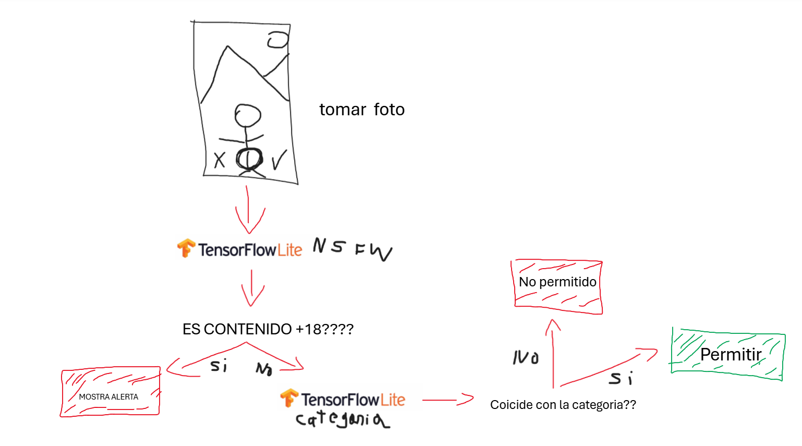

# Clasificador de Imágenes por Categoría

Esta es una prueba de concepto de una aplicación Android que permite:

1. Tomar una foto desde la cámara.
2. Verificar si la imagen contiene contenido sensible (+18) mediante un modelo NSFW.
3. Clasificar la imagen por categorías específicas usando un modelo de clasificación.
4. Validar si la categoría seleccionada coincide con el resultado del modelo.

## Ejemplo visual del flujo

## Tecnologías utilizadas

- Jetpack Compose
- ViewModel
- CameraX
- TensorFlow Lite
- Kotlin

## Estado

🔧 Prueba de concepto funcional.